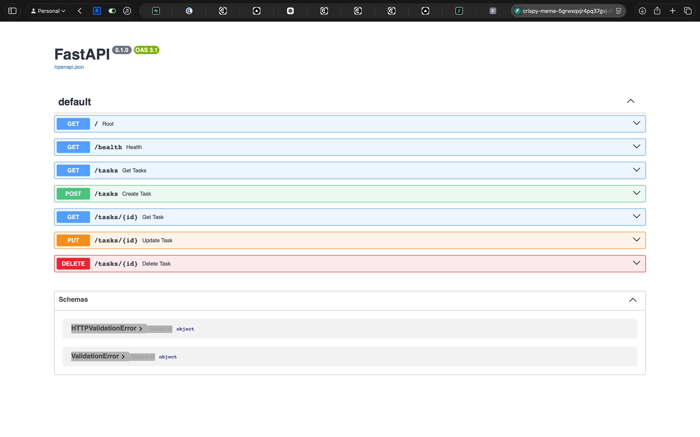

# Week 2 Assignment - Task CRUD API

A FastAPI-based REST API for managing a task list with full CRUD (Create, Read, Update, Delete) operations. This API allows users to create, retrieve, update, and delete tasks with support for filtering and status tracking.

## How to run

```bash
# Install dependencies
pip install fastapi uvicorn

# Start the server
uvicorn main:app --reload
```

The API will be available at `http://localhost:8000`

## Endpoints

| Method | Path         | Description                              |
|--------|--------------|------------------------------------------|
| GET    | /            | Welcome message with API info            |
| GET    | /health      | Health check endpoint                    |
| GET    | /tasks       | Retrieve all tasks                       |
| GET    | /tasks/{id}  | Retrieve a specific task by ID           |
| POST   | /tasks       | Create a new task                        |
| PUT    | /tasks/{id}  | Update an existing task                  |
| DELETE | /tasks/{id}  | Delete a task                            |

## Example request

```bash
# Get all tasks
curl -i http://localhost:8000/tasks

# Get a specific task
curl -i http://localhost:8000/tasks/1

# Create a new task
curl -i -X POST http://localhost:8000/tasks \
  -H "Content-Type: application/json" \
  -d '{"title": "Study FastAPI", "done": false}'

# Update a task
curl -i -X PUT http://localhost:8000/tasks/1 \
  -H "Content-Type: application/json" \
  -d '{"title": "Study FastAPI", "done": true}'

# Delete a task
curl -i -X DELETE http://localhost:8000/tasks/1
```

## Swagger UI



## AI vs Me

I gave an AI a prompt describing this same API from scratch, on a separate `ai-branch`, without letting it see my code. Comparing the two afterward:

**What did the AI do better — and do I understand it well enough to explain it?**
It caught a real bug I didn't notice: my `POST /tasks` appends the new task to the list *before* checking whether `title` was provided, so a bad request still pollutes the data even though it returns a 400. The AI's version validates through a Pydantic model before the handler ever runs, so that class of bug can't happen there. It also uses consistent status codes (`201` on create, `422` on bad input) where mine leans on `400` everywhere. Yes — I understand why it works, it's standard FastAPI/Pydantic, nothing I'd need to look up.

**What did it get wrong or quietly ignore from my prompt?**
I typed "GET /task" (singular) in my prompt; it silently pluralized it to `/tasks` without flagging that it changed my wording. It also dropped `id` from the request body on create entirely — I'd described the task object as `{id, title, done}`, which reads like `id` is something a client could send, but the AI decided server-side auto-increment instead and didn't call out that it was overriding that.

**What did my prompt forget to specify — and what did the AI silently decide for me?**
I never said whether `PUT` should be a full or partial update — it chose "both fields required." I never gave a minimum title length — it picked `min_length=1` on its own. I never said what a successful `DELETE` should return — it invented a `{"message": ...}` body instead of a plain `204 No Content`. And I never thought about concurrency at all — its task counter is a bare global int, not safe under concurrent requests, and I didn't catch that until I went looking for what it had assumed.
